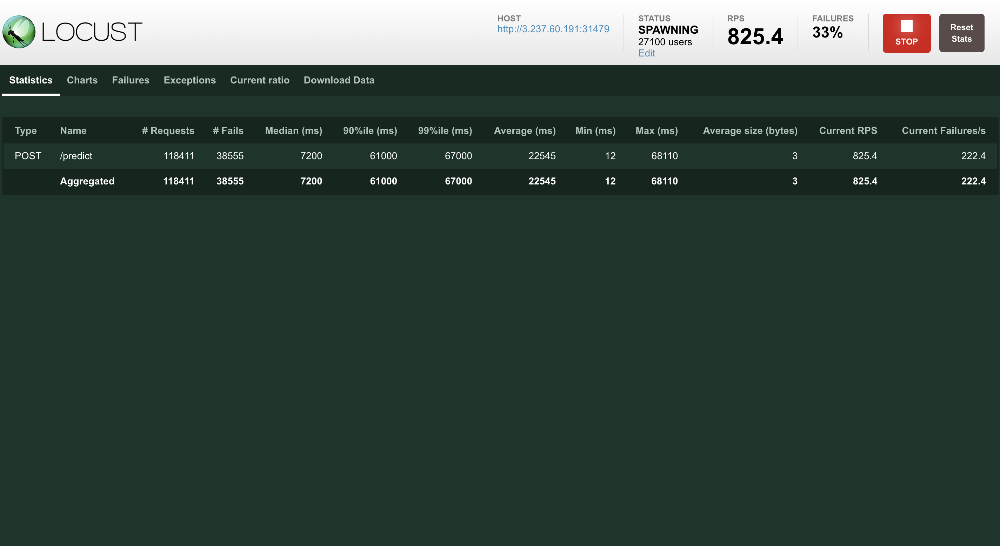

# Final Project: Spam Detector

dataset: https://www.kaggle.com/datasets/uciml/sms-spam-collection-dataset

training a spam classification model using a bag-of-words approach with Naive Bayes.

build image
```
docker build -t spam-api .
```

run container
```
docker run -p <port>:8888 spam-api
```


http request (test locally)
```
curl -X POST -H "Content-Type: application/json" -d '{"message": "<email-content>"}' http://localhost:80/predict
```

Deployed on eks cluster with two replicas

Access urls:
- http://44.201.253.122:31479/predict
- http://3.237.60.191:31479/predict


## Loadtest
We find a spam message dataset to loadtest our training model(see ham_spam_test.csv). Our load test program fetch a ramdom message in the dateset and send a POST request to the API endpoint with the selected message.

To run the loadtest, we need to first install:
```
pip install locust
```
then run command:

```
locust -f locustfile.py
```




