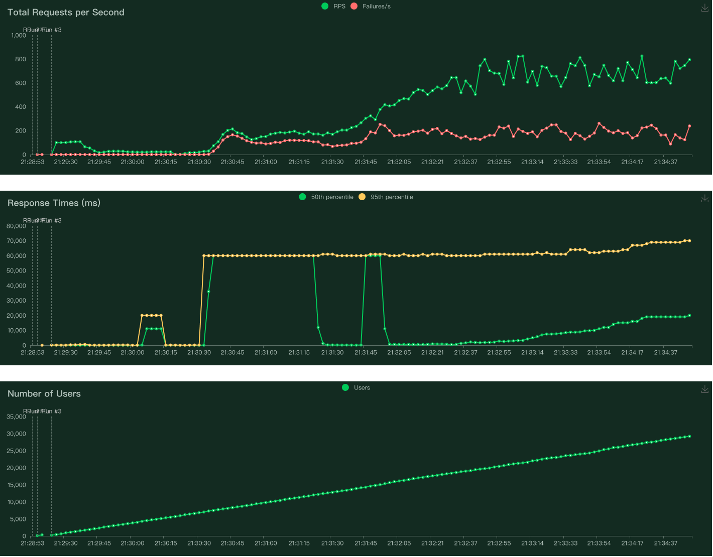

dataset: https://www.kaggle.com/datasets/uciml/sms-spam-collection-dataset

build image
```
docker build -t spam-api .
```

run container
```
docker run -p <port>:8888 spam-api
```


http request (test locally)
```
curl -X POST -H "Content-Type: application/json" -d '{"message": "<email-content>"}' http://localhost:80/predict
```

Deployed on eks cluster with one replica

Access url: http://44.203.218.121:31479/predict


## Loadtest


